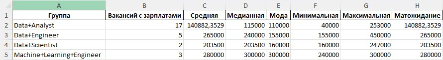

# hh_researcher

Скрипт для парсинга, анализа и сравнения зарплат по выбранным профессиям. Скрейпит вакансии с сайта Head Hunter (hh.ru) и подсчитывает статистику. Использует API hh.ru для сбора данных по заданным ключевым словам, группирует вакансии по специализациям и сохраняет результаты в формате .csv и .xlsx.



## Содержание

* [Основные функции](#Основные_функции)
* [Быстрое начало](#Быстрое_начало)
* [Анализ_результатов](#Анализ_результатов)
  * [./data/raw](#./data/raw)
  * [./data/processed](#./data/processed)
* [Настройки парсинга](#Настройки_парсинга)
  * [Опыт работы](#Опыт_работы)
  * [Тип занятости](#Тип_занятости)
  * [График работы](#График_рабтоты)
  * [География поиска](#География_поиска)
    * [Поиск по стране](#Поиск_по_стране)
    * [Поиск по региону, области, республике](#Поиск_по_региону_области_республике)
    * [Поиск по городу](#Поиск_по_городу)
* [Продвинутый поиск вакансий](#Продвинутый_поиск_вакансий)
  * [Пример №1: Поиск вакансии по ключевому слову](#Пример_1)
  * [Пример №2: Поиск вакансии по ключевой фразе](#Пример_2)
  * [Пример №3: Поиск вакансий по списку синонимов](#Пример_3)
  * [Пример №4: Поиск вакансий по группам ключевых слов](#Пример_4)
* [Расчеты](#Расчеты)
  * [Нормализация зарплат](#Нормализация_зарплат)

<h2 id="Основные_функции" >Основные функции</h2>

* <ins>Сбор данных:</ins> Скрипт отправляет запросы к API, чтобы получить вакансии, соответствующие указанным критериям.
* <ins>Группировка:</ins> Вакансии группируются по специализациям для удобства анализа.
* <ins>Анализ зарплат:</ins> Скрипт рассчитывает статистику по зарплатам для каждой группы вакансий, включая:
  * Минимальная зарплата
  * Максимальная зарплата
  * Среднеарифметическая зарплата
  * Медианная зарплата
  * Мода
  * Матожидание

Эти данные помогают пользователям лучше понять рынок труда и принимать обоснованные решения при поиске работы или найме сотрудников.

Для получения данных используется метод [get_vacancies](https://api.hh.ru/openapi/redoc#tag/Poisk-vakansij/operation/get-vacancies) сайта hh.ru

<h2 id="Быстрое_начало" >Быстрое начало</h2>

0. Клонируйте проект

``` Bash
git clone git@github.com:novangarde/hh_researcher.git
```

1. Обновите список пакетов:

```Bash
sudo apt update
```

2. Установите интерпретатор Python3, менеджер пакетов pip и инструмент для создания изолированных виртуальных окружений Virtualenv:

```Bash
sudo apt install python3 python3-pip python3-venv
```

3. Создайте виртуальное окружение:

```Bash
python3 -m venv <название> # пример: python3 -m venv test
```

4. Активируйте виртуальное окружение:

```Bash
source ./<название>/bin/activate # пример: source ./test/bin/activate
```

5. Установите зависимости из файла requirements.txt:

```Bash
pip install -r requirements.txt
```

6. Запустите скрипт, передав ему в качестве аргумента название вакансии в кавычках:

```Bash
python3 researcher.py <название+искомой+вакансии> # пример: python3 researcher.py "Data Scientist"
```

7. Собранные данные о вакансиях вы найдете в следующих директориях:
* `data/raw` - для сырых данных
* `data/processed` - для обработанных

<h2 id="Анализ_результатов">Анализ результатов</h2>

После запуска скрипта у вас будет выгрузка всех вакансий по выбранным должностям, с выбранными настройками. "Сырые" данные будут храниться в `./data/raw`, а обработанные - в `./data/processed`. Помимо списка собранных вакансий у вас будет единая .xlsx-таблица с вакансиями для удобного анализа вручную и файл со статистикой по зарплатам для выбранных должностей.

<h3 id="./data/raw">./data/raw</h3>

В этой директории хранятся .csv-файлы со списками вакансий. Если вы парсили данные из файла, используя несколько списков, то собранные вакансии будут сгруппированы по отдельным файлам. Для примера, давайте представим .txt-файл следующего содержания:

```
[Data Scientist, Data Science]
[Data Engineer, Инженер данных]
```

После его парсинга в директории `./data/raw` появятся файлы `Data+Scientist.csv` и `Data+Engineer.csv`.

<h3 id="./data/processed">./data/processed</h3>

В этой директории хранятся обработанные данные: комбинированный файл со всеми найденными вакансиями в двух расширениях (.csv и .xlsx) и файл со статистикой зарплат, разбитой по категориям вакансий:
* _combined.csv - комбинированный файл с вакансиями
* _combined.xlsx - тот же файл, но в .xlsx

<h2 id="Настройки_парсинга">Настройки парсинга</h2>

Для более точного парсинга вакансий стоит прописать необходимые настройки поиска. Для этого откройте файл `./src/config.py` и найдите метод `def __init__(self)` внутри класса `class Config`. В указанном методе вы можете изменять следующие переменные, чтобы влиять на результаты поиска:

* `self.__experience`
* `self.__employment`
* `self.__schedule`
* `self.__country`
* `self.__region`
* `self.__city`

<h3 id="Опыт_работы">Опыт работы</h3>

За эту настройку отвечает следующий параметр:

``` Python
self.__experience = "noExperience" # ['noExperience', 'between1And3', 'between3And6', 'moreThan6']
```

Вы можете изменить его на один из четырех вариантов:
* `noExperience` - для поиска вакансий для тех, у кого нет опыта.
* `between1And3` - опыт от 1 года до 3 лет.
* `between3And6` - опыт от 3 до 6 лет.
* `moreThan6`    - опыт более 6 лет.

<h3 id="Тип_занятости">Тип занятости</h3>

За эту настройку отвечает следующий параметр:

``` Python
self.__employment = "full" # ['full', 'part', 'project', 'volunteer', 'probation']
```

Вы можете изменить его на один из четырех вариантов:
* `full`         - для поиска вакансий на полную занятость.
* `part`         - частичная занятость.
* `project`      - проектная работа.
* `volunteer`    - волонтерство.
* `probation`    - стажировка.

<h3 id="График_работы">График рабтоты</h3>

За эту настройку отвечает следующий параметр:

``` Python
self.__schedule = "fullDay" # ['fullDay', 'shift', 'flexible', 'remote', 'flyInFlyOut']
```

Вы можете изменить его на один из четырех вариантов:
* `fullDay`       - для поиска вакансий на полный рабочий день.
* `shift`         - неполный рабочий день.
* `flexible`      - гибкий график.
* `remote`        - удаленная работа.
* `flyInFlyOut`   - вахтовый метод.

<h3 id="География_поиска">География поиска</h3>

За эту настройку отвечают три параметра:

```Python
self.__country = "Россия" # Страна, к примеру, "Россия"
self.__region = "" # Регион, к примеру, "Республика Башкортостан"
self.__city = "" # Город, к примеру, "Стерлитамак"
```

<h4 id="Поиск_по_стране">Поиск по стране</h4>

Если хотите осуществить поиск по всей стране, укажите название страны в `self.__country` (если оставить поле пустым, поиск автоматически будет искать по России). Поля `self.__region` и `self.__city` оставьте пустыми.

<h4 id="Поиск_по_региону_области_республике">Поиск по региону, области, республике</h4>

Если хотите искать по региону внутри страны, укажите название страны в `self.__country` и название региона в `self.__region`. Поле `self.__city` оставьте пустым.

> 💡 **Подсказка:** Список доступных регионов внутри выбранной вами страны можно найти в `./samples/hh_areas_list_sample.json`

<h4 id="Поиск_по_городу">Поиск по городу</h4>

Для поиска по городу заполните поля `self.__country` и `self.__city`. Поле `self.__region` заполнять не обязательно, но это может ускорить поиск, а также поможет избежать ошибок, потому что в одной стране может быть несколько населенных пунктов с одним и тем же названием.

> 💡 **Москва и Санкт-Петербург не относятся к городам:** чтобы осуществить по ним поиск, впишите их названия в `self.__region`, а поле `self.__city` оставьте пустым.

> 💡 **Подсказка:** Список доступных городов внутри выбранной страны и региона находится в `./samples/hh_areas_list_sample.json`

<h2 id="Продвинутый_поиск_вакансий">Продвинутый поиск вакансий</h2>

Скрипт способен искать вакансии в трех режимах:
1. Одна вакансия
2. Одна группа вакансий
3. Несколько групп вакансий

Под группой вакансий мы понимаем однородный список ключевых слов, состоящих из синонимов одной и той же роли внутри компании, к примеру:

``` Python
["Data Analyst", "Аналитик данных", "Специалист по анализу данных", "Специалист по обработке данных"]
```

Глядя на этот список, мы понимаем, что речь идет примерно об одной и той же вакансии, но работодатель мог назвать ее по-разному, поэтому мы можем передать в скрипт список синонимов, он осуществит поиск по каждому ключевому слову из списка и сгруппирует их по первому ключевому запросу. В приведенном выше примере в результате парсинга мы получим файл `Data+Analyst.csv`, внутри которого будут собраны результаты поиска по каждому из перечисленных синонимов.

Дальше разберем примеры поиска, чтобы понять, какие опции существуют.

<h3 id="Пример_1">Пример №1: Поиск вакансии по ключевому слову</h3>

```Bash
python3 researcher.py Программист
```

Результаты:
* `./data/raw/Программист.csv`      - тут будут данные только по вакансиям, в названии которых встречается слово "Программист"
* `./data/processed/_combined.csv`  - содержимое будет аналогично содержимому файла выше
* `./data/processed/_combined.xlsx` - тот же файл, но в .xlsx

<h3 id="Пример_2">Пример №2: Поиск вакансии по ключевой фразе</h3>

```Bash
python3 researcher.py "Data Scientist" # ключевую фразу нужно заключить в кавычки
```

```Bash
python3 researcher.py Data+Scientist # либо заменить пробелы на "+", превратив ее в одно слово
```

Результаты:
* `./data/raw/Data+Scientist.csv`   - список вакансий с "Data Scientist"
* `./data/processed/_combined.csv`  - содержимое будет аналогично содержимому файла выше
* `./data/processed/_combined.xlsx` - тот же файл, но в .xlsx

<h3 id="Пример_3">Пример №3: Поиск вакансий по списку синонимов</h3>

```Bash
python3 researcher.py "[Data Engineer, Инженер данных]" # синонимы разделяем запятыми внутри квадратных скобок, снаружи заключаем в кавычки
```

Результаты:
* `./data/raw/Data+Engineer.csv`   - список вакансий по фразам "Data+Engineer" и "Инженер+данных", понять, что по какому запросу было найдено можно будет по столбцу `keyword`
* `./data/processed/_combined.csv`  - содержимое будет аналогично содержимому файла выше
* `./data/processed/_combined.xlsx` - тот же файл, но в .xlsx

<h3 id="Пример_4">Пример №4: Поиск вакансий по группам ключевых слов</h3>

```Bash
python3 researcher.py ./samples/keywords_list_ds.txt # вместо ./samples/keywords_list_ds.txt можете выбрать свой файл
```

Содержимое файла `./samples/keywords_list_ds.txt`:

```
[Data Analyst, Аналитик данных, Специалист по анализу данных, Специалист по обработке данных]
[Data Scientist, Data Science]
[Data Engineer, Инженер данных]
[Machine Learning Engineer, Machine Learning, ML Engineer, ML инженер, ML специалист, Инженер машинного обучения, Специалист по машинному обучению]
```

Результаты:
* `./data/raw/Data+Analyst.csv`             - список вакансий по списку синонимам из __первой__ строки файла `./samples/keywords_list_ds.txt`
* `./data/raw/Data+Scientist.csv`           - список вакансий по списку синонимам из __второй__ строки файла `./samples/keywords_list_ds.txt`
* `./data/raw/Data+Engineer.csv`            - список вакансий по списку синонимам из __третьей__ строки файла `./samples/keywords_list_ds.txt`
* `./data/raw/Machine+Learning+Engineer.csv`- список вакансий по списку синонимам из __четвертой__ строки файла `./samples/keywords_list_ds.txt`
* `./data/processed/_combined.csv`          - все вакансии из всех файлов выше.
* `./data/processed/_combined.xlsx`         - тот же файл, но в .xlsx

> 💡 **Подсказка:** Создайте свой .txt-файл для поиска вакансий по аналогии с файлами `vacancies_lists...txt` из `./samples`

<h2 id="Расчеты">Расчеты</h2>

<h3 id="Нормализация_зарплат">Нормализация зарплат</h3>

Скрипт рассчитывает средне-арифметическую зарплату, медиану, моду, максимальное и минимальное значение. Прежде чем рассчитать все эти показатели, данные о зарплате в вакансиях нужно нормализовать, потому что они не всегда публикуются в корректном виде.

__Во-первых__, могут попадаться данные в разных валютах. Сейчас скрипт отбрасывает все значения, кроме рублевых.
__Во-вторых__, работодатели не всегда указывают минимальную и максимальную зарплату. Часто бывает либо одно, либо другое, но порой данных о зарплате нет вовсе. Поэтому для расчетов мы выбираем следующую стратегию:

1. Если есть только минимальная зарплата, считаем, что это зарплата, которую платят на этой вакансии.
2. Если есть только максимальная, считаем, что это зарплата, которую платят на этой вакансии.
3. Если есть и максимальная, и минимальная зарплаты, суммируем их и делим на 2, вычисляя средне-арифметическое значение. Считаем, что это та зарплата, которую платят на этой вакансии.

__В-третьих__, в некоторых вакансиях зарплаты указаны на три разряда ниже, чем на самом деле, то есть, вероятнее всего, подразумевается зарплата от 100 000 до 120 000 рублей, а в вакансии указано от 100 до 120, три разряда отбросили. В таких случаях беру на себя смелость умножить зарплату на 1000 в целях нормализации статистики.

Минимальную и максимальную зарплаты высчитываем по пиковым значениям.
